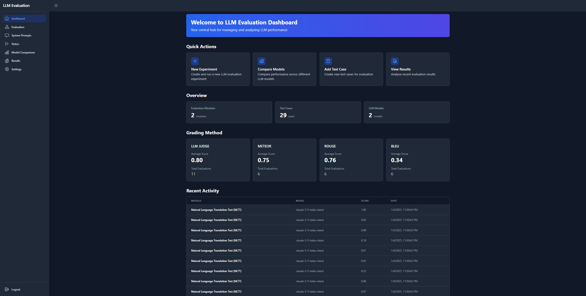

# LLM Evaluation Platform

<div align="center">
  
</div>

## Overview
The LLM Evaluation Platform is a comprehensive tool designed to evaluate and compare different Large Language Models (LLMs) using multiple evaluation metrics. It provides a modern web interface for testing, comparing, and analyzing LLM responses across various test cases and modules.

## Features
- **Multiple Model Support**: Built-in support for OpenAI and Anthropic models, with easy extensibility for other LLMs
- **Comprehensive Evaluation Metrics**:
  - ROUGE (Recall-Oriented Understudy for Gisting Evaluation)
  - BLEU (Bilingual Evaluation Understudy)
  - METEOR (Metric for Evaluation of Translation with Explicit ORdering)
  - LLM Judge (AI-based evaluation using a LLM model)
- **Test Case Management**: Create and organize test cases within modules
- **Real-time Evaluation**: Instantly compare model responses against reference answers
- **Simple UI**: Modern, responsive interface with dark mode support
- **Detailed Analytics**: In-depth scoring and analysis of model responses

## Installation

### Prerequisites
- Python 3.12+
- Node.js 22+
- npm or yarn

### Backend Setup
1. Create a Python virtual environment in the `llm_evaluation` directory:
```bash
cd llm_evaluation
python -m venv .venv
```

2. Activate the virtual environment:
- Windows:
```bash
.venv\Scripts\activate
```
- Unix/MacOS:
```bash
source .venv/bin/activate
```

3. Install Python dependencies:
```bash
pip install -r requirements.txt
```

4. Create a `.env` file in the `llm_evaluation` directory with your API keys:
```env
OPENAI_API_KEY=your_openai_key
ANTHROPIC_API_KEY=your_anthropic_key
```

### Frontend Setup
1. Install Node.js dependencies:
```bash
npm install
```

2. Configure the Vite proxy:
In `vite.config.js`, ensure the proxy target matches your backend server:
```javascript
export default defineConfig({
  server: {
    proxy: {
      '/api': {
        target: 'http://localhost:3000',
        changeOrigin: true
      }
    }
  }
})
```

## Running the Application

### Development Mode
Run frontend and backend separately:
```bash
# Frontend
npm run dev:frontend

# Backend
npm run dev:backend
```

Or run both concurrently:
```bash
npm run dev
```

## Adding New LLM Models
The platform is designed for easy integration of new LLM models. To add a new model:

1. Create a new implementation class in `llm_evaluation/models.py`
2. Inherit from the `LLMImplementation` base class
3. Implement the required methods:
   - `get_model_info()`: Provide model metadata
   - `generate_response()`: Implement the response generation logic

Example:
```python
class NewModelImplementation(LLMImplementation):
    def get_model_info(self) -> ModelInfo:
        return ModelInfo(
            name="NewModel",
            requires_api_key=True,
            available_models=["model-1", "model-2"],
            description="Description of the new model"
        )
    
    def generate_response(self, api_key: Optional[str], system_prompt: Optional[str], user_prompt: str, model: str) -> str:
        # Implement response generation logic
        pass
```

## Evaluation Metrics

### ROUGE Score
- Evaluates text similarity using precision, recall, and F-measures
- Includes ROUGE-1 (unigram), ROUGE-2 (bigram), and ROUGE-L (longest common subsequence)

### BLEU Score
- Measures translation quality by comparing n-gram matches
- Incorporates precision and brevity penalty
- Industry standard for translation evaluation

### METEOR Score
- Evaluates translation considering exact matches, stems, synonyms, and paraphrases
- Addresses limitations of BLEU scoring
- Language-aware evaluation

### LLM Judge
- AI-based evaluation using language models
- Assesses multiple attributes:
  - Accuracy
  - Relevance
  - Coherence
  - Ethical considerations
  - Professionalism
  - Reasoning
  - Creativity

## Project Structure
```
llm_evaluation/
├── models.py          # LLM implementations
├── evaluator.py       # Evaluation logic
├── requirements.txt   # Python dependencies
└── run_tests.py      # Test execution

src/
├── components/        # React components
│   ├── models/
│   ├── prompts/
│   ├── results/
│   ├── settings/
│   └── testcases/
└── App.jsx           # Main application

server/
├── index.js          # Express server
├── routes/           # API routes
└── services/         # Backend services
``` 